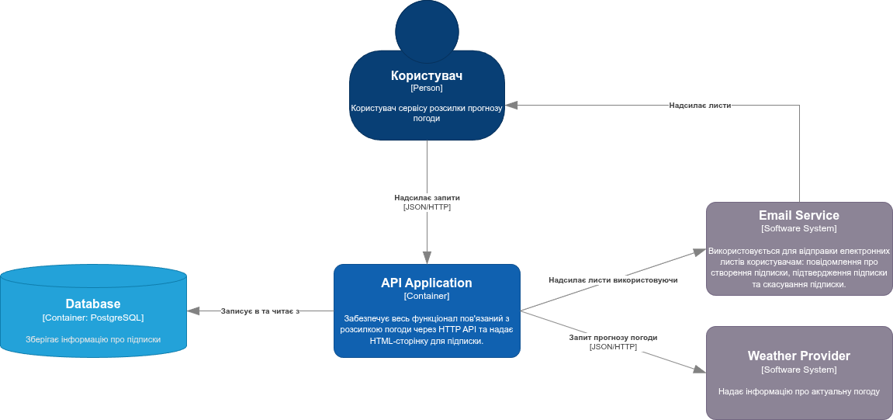

# Огляд проекту

**Назва**: Weather Forecast

**Опис**: Цей сервіс дозволяє користувачам підписатися на email-розсилку погоди для обраного міста. Доступні два типи підписки: щогодинна та щоденна.

---
# Вимоги

### Функціональні

- Користувач повинен мати змогу створити підписку, вказавши містро та тип розсилки - щогодинна або щоденна.
- Система має надсилати лист про підписку з токеном для підтвердження та скасування підписки через email.
- Система має генерувати один унікальний токен для кожної підписки, який використовується як для підтвердження, так і для скасування розсилки.
- Користувач повинен мати змогу підтвердити підписку, використовуючи токен.
- Користувач повинен мати змогу відписатись від розсилки , використовуючи токен.
- Сервіс має надсилати листи про підтвердження підписки та про відписку від розсилки через email. 
- Сервіс має надсилати актуальну інформацію про погоду користувачу згідно з обраним типом підписки через email.
- Користувачі повинні мати змогу взаємодіяти з сервісом(підписуватись на розсилку, відписуватись від розсилки, підтверджувати підписку, отримувати інформацію про погоду) через HTTP API. 

### Нефункціональні
> Примітка: наразі деякі нефункціональні вимоги реалізовані частково або ще не реалізовані. Вони описані в розділі "Заплановані покращення".

- Документація: Сервіс повинен мати детальну технічну документацію, яка описує всі доступні API-ендпоїнти.
- Моніторинг і логування: Повинні бути реалізовані логування помилок та основних дій сервісу.
- Тестованість: Всі компоненти системи повинні бути покриті тестами.
- Розширюваність: Архітектура система має довзволяти легко вносити нові зміни.
- Час відповіді від API не має перевищувати 300 мс у 95% запитів, за винятком зовнішніх сторонніх викликів, наприклад, API сервісу прогнозу погоди.
- Відмовостійкість: У випадку недоступності основного сервісу пронозу погоди, сервіс повинен звертатись до резервного пройвайдера погоди.
- Надійність: Сервіс повинен гарантувати доставку емейлів.
- Навантаження: Система має бути здатна обробляти до 100 000 повідомлень в день.

---

# High-level діаграма

Система складається з таких основних компонентів:

- **API Applicaton** — основний сервіс, що обробляє HTTP-запити, керує підписками, надає HTML-сторінку для підписки.
- **Database** — зберігає інформацію про підписки.
- **Email Service** — відправляє емейли через SMPT.
- **Weather Povider** — third-party сервіс, який використовується для отримання інформації про актуальну погоду
- **Користувач** — взаємодіє з сервісом через HTML-сторінку або через API.



---
# Опис бази даних

### Таблиця `Subscription`

Містить інформацію про підписки користувачів на розсилку прогнозу погоди.

| Поле         | Тип даних (PostgreSQL, як зберігає GORM) | Опис                                                         |
| ------------ | ---------------------------------------- | ------------------------------------------------------------ |
| `id`         | `serial`                                 | Первинний ключ. Унікальний ідентифікатор підписки.           |
| `email`      | `varchar(255)`                           | Електронна пошта користувача.        |
| `city`       | `varchar(255)`                           | Назва міста,на яке підписався користувач.          |
| `token`      | `varchar(255)`                           | Унікальний токен для підтвердження або скасування підписки.  |
| `frequency`  | `text`                                   | Частота розсилки. Може приймати значення `daily` або `hourly`. |
| `confirmed`  | `boolean`                                | Індикатор підтвердження підписки. За замовчуванням — `false`.        |
| `created_at` | `timestamp with time zone`               | Дата та час створення підписки.      |

---

# API Endpoints


### GET /weather

Get the current weather forecast

##### Example Input: 
```
{
	"city": "Kyiv"
} 
```

### POST /subscribe

Subscribe to weather updates (a confirmation email will be sent)

##### Example Input: 
```
{
	"email": "youremail@mail.com",
	"city": "Kyiv",
	"frequency": "hourly"
} 
```


### GET /confirm/{token}

Confirm the email subscription

##### URL Parameters:
- `token` – confirmation token (UUID format) sent via email

##### Example:
`GET /confirm/3fa85f64-5717-4562-b3fc-2c963f66afa6`

### GET /unsubscribe/{token}

Cancel the email subscription.

##### URL Parameters:
- `token` – unsubscribe token (UUID format)

##### Example:
`GET /unsubscribe/3fa85f64-5717-4562-b3fc-2c963f66afa6`

---


# Заплановані покращення

### 1. Покращення гарантій доставки email-повідомлень

Наразі повідомлення відправляються через SMTP, і при помилці вони не повторюються. У майбутньому планується реалізувати чергу повторних спроб, яка дозволить гарантувати доставку навіть у разі тимчасової помилки SMTP-сервера.

### 2. Додавання резервного провайдера погоди

Поточна релізація використовує тільки один сервіс прогнозу погоди - `weatherapi`, проте у разі його недоступності користувач не отримає оновлень погоди. Тому планується додавання резервного провайдера, що буде використаний у разі виникнення помилки на стороні основного провайдера.

### 3. Додавання таблиці `locations` до бази даних

Зараз при створені підписки поле `city` не перевіряється на існування. Якщо користувач вкаже неіснуюче місто або місто, яке не підтримується провайдером погоди, то після підписки він отримає email з повідомленням про помилку.
 

Щоб уникнути цього, планується додавання таблиці `locations`:
| Поле         | Тип            | Опис                                |
| ------------ | -------------- | ----------------------------------- |
| `id`         | `serial`       | Унікальний ідентифікатор            |
| `name`       | `varchar(255)` | Назва міста (унікальна)             |
| `created_at` | `timestamp`    | Дата додавання                      |

І тепер у разі створення підписки, спочатку буде перевірятись таблиця `locations` на наявність вказаного міста і у разі, якщо такого міста ще немає в базі даних, то його існування буде перевірятись за допомогою сервісу прогнозу погоди. 

Такий підхід забезпечує доставку оновлень погоди користувачу, якщо він ввів коректну назву міста, а також дозволяє пришвидшити перевірку міста на коректність завдяки використанню локальної бази.

